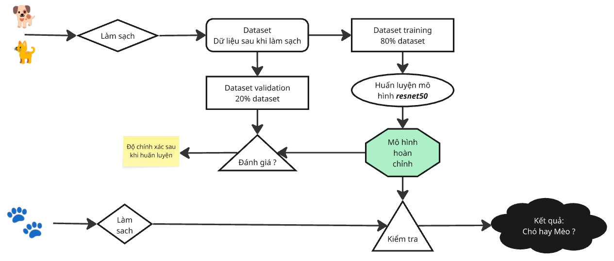

# Phân loại ảnh chó mèo bằng Deep learning

### Sơ đồ mô hình

### Luồng code

Muốn đọc để hiểu toàn bộ dự án này thì cần đọc code với trình tự như sau:
1. Đọc file python làm sạch dữ liệu ảnh - [Preprocess_images.py](source/preprocess_images.py)

2. Chạy file [Preprocess_images.py](source/preprocess_images.py) để kiểm tra xem có ảnh nào hỏng không? Nếu có, hãy loại bỏ chúng.

3. Đọc hàm main.  
Chú ý: - Không đọc toàn bộ mà đọc từng dòng.  
       - Khi gặp một hàm (def) hay lớp (class) thì phải chuyển sang def đó, class đó để  đọc hiểu. Nếu def hay class đó nằm trong thư viện có sẵn từ Python thì cần lên chatGPT/Claude/Grok (hoặc công cụ LLM nào đó) để hỏi về cách sử dụng, quan trọng là input và output.

    a. Đầu tiên: class SafeTransform - "dịch thuật" an toàn cho AI hiểu
    b. Thứ hai: class DogCatDataset - Tạo dữ liệu huấn luyện và đánh giá
    c. Thứ ba: class DogCatClassifier - Tạo mô hình
    d. Thứ tư: def train_model
    e. Thứ năm: lưu mô hình đã huấn luyện vào file .pth
    f. Cuối cùng: def predict_image - Kiểm tra bằng 1 ảnh từ nguồn bên ngoài xem mô hình có chính xác chỉ ra là chó hay mèo không?

### Hướng dẫn chaỵ code trên Colab
- Có hai cách chạy code trên Colab
 + Cách 1: Chạy code cách gọi file main.py
 + Cách 2: Chạy code được viết tại file code-3.ipynb.  
    Tải notebook lên Colab sau đó thực hiện chạy từng shell.
- Hướng dẫn chi tiết tại Readme_colab.md

### Hướng dẫn chạy code trên Kaggel
- Có hai cách chạy code trên Kaggel
 + Cách 1: Chạy code cách gọi file main.py
 + Cách 2: Chạy code được viết tại file code-3.ipynb.  
    Tải notebook lên Kaggel sau đó thực hiện chạy từng shell.
- Hướng dẫn chi tiết tại Readme_kaggel.md

